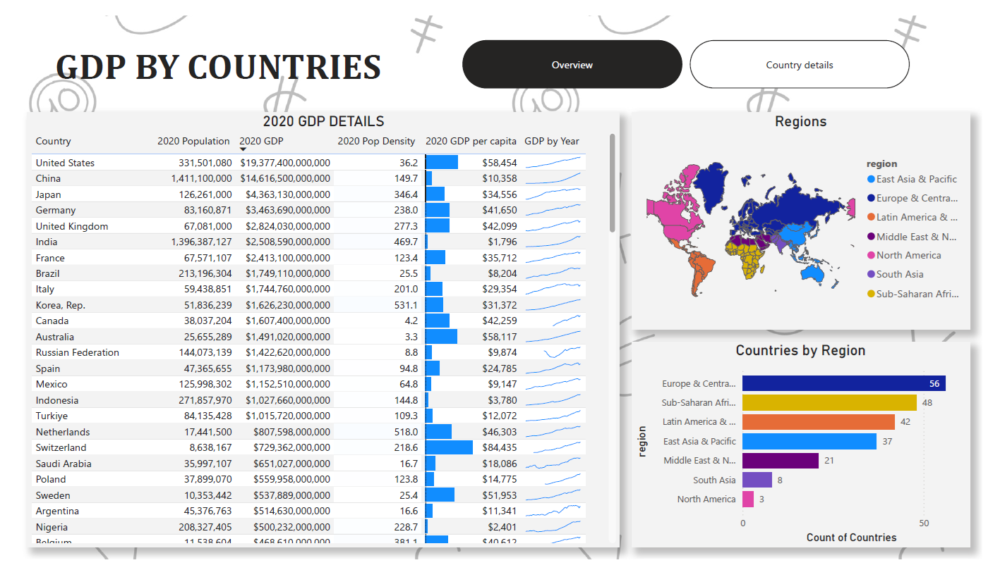
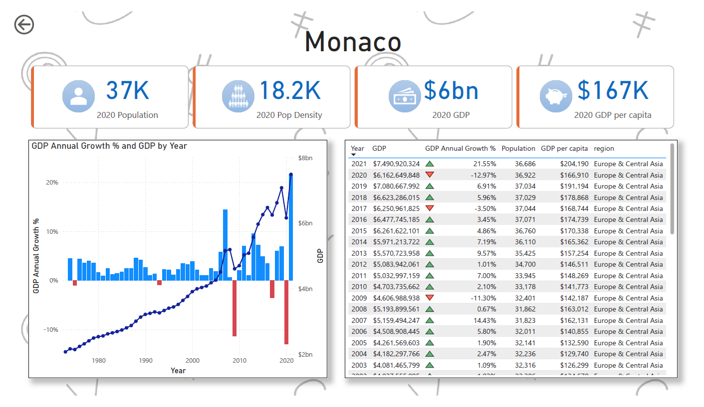

# BI-dashboards-portfolio
A collection of Power BI dashboards showcasing data analytics skills

---------------------------------------------------------------------------------------------------------------------------------------------------------------------------
---------------------------------------------------------------------------------------------------------------------------------------------------------------------------

# 1- Bitcoin price analysis dashboard

This Power BI dashboard is designed to provide an in-depth analysis of Bitcoin's market activity using multiple technical indicators such as RSI, Moving Averages, and Volume. It visualizes Bitcoin's historical price, market capitalization (both current and historical), and daily volume profile to help users analyze the market trends.

## Features

- **RSI (Relative Strength Index)**: Displays the momentum and overbought/oversold conditions of Bitcoin.
- **Moving Average**: Tracks the short-term and long-term trends of Bitcoin prices.
- **Bitcoin Historical Price and Market Cap**: Visualizes both current and historical Bitcoin prices and market capitalization.
- **Daily Volume Profile**: Categorizes the daily trading volume as high, medium, or low based on historical averages.

## Requirements

- Power BI Desktop (or Power BI Service)
- Internet connection

## Data Source

Open source .CSV data accessible from https://coinmarketcap.com/currencies/bitcoin/historical-data/

Power BI file available here [Download the Power BI Report](Bitcoin-Analysis.pbix)

##  Overview page:  

- **Price Chart**: Displays Bitcoin's historical price and moving averages over different time frames including volume.
- **RSI Indicator**: Visualizes the RSI values to help identify overbought or oversold conditions.
- **Volume Analysis**: Table showcasing specific information such as daily opening/closing price, Volume, Daily volume profile and trend.
- **Market Cap**: Displays Bitcoin's market capitalization over time, comparing it with historical data.
- **Timeframe slicer** this slicer used to select the preferred timeframe to look and analyse
- **Signal** This visual suggests possible buy/sell/netral signals based on different factors such as volume/RSI/MA. (**Not financial advice**)

  
  
## Moving Average page:  

- **Price Chart**: Displays Bitcoin's historical price and moving averages over different time frames.
- **Moving average period selector**: Using this slicer period for moving average can be modified to retrieve 50/100/150/200 days moving average.

  
  
## Contributing

Feel free to open issues or submit pull requests if you'd like to contribute to this project. Contributions are always welcome!

---------------------------------------------------------------------------------------------------------------------------------------------------------------------------
---------------------------------------------------------------------------------------------------------------------------------------------------------------------------

# 2- Power BI Global GDP Dashboard

This Power BI dashboard provides a comprehensive analysis of global GDP data, showcasing GDP and GDP per capita across different countries and regions. The dashboard allows users to interactively explore the economic state of countries, drill into specific details, and analyze GDP trends over the years.

## Features

- **Global Overview**: A world map displaying countries with their GDP and GDP per capita, segmented by regions.
- **Interactive Map**: Users can select a country or region from the map to view specific economic details.
- **Yearly GDP Data**: Displays GDP over the years for selected countries.
- **GDP per Capita**: Shows the GDP per capita for countries and regions, providing insight into economic performance on a per-person basis.
- **Country Drill-Down**: By selecting a country on the map, users can drill into a detailed view of that country’s economic state, including GDP and GDP per capita over time.

## Requirements

- **Power BI Desktop** (or Power BI Service)

## Data Source

Open source economic data

##  Overview page

- **2020 GDP**: This table showing latest GDP data information for 2020. Showcasing Countries population, GDP, GDP per capita, Population density using interactive visuals.
- **Map**: By selecting a country on the map, users can drill into a detailed view of that country’s economic state.


##  Detail page

Click on any country to drill into its detailed page, where you will find:
- The country’s GDP over multiple years.
- GDP per capita over the selected period.
- A breakdown of the country’s economic state and trends.

## How to Use

1. **Explore by Region or Country**: Click on any region or country on the world map to filter the data.
2. **Drill into Country Detail**: Once a country is selected, the dashboard will drill into its economic data, showing detailed GDP and GDP per capita trends.
3. **Hover Over Countries**: Hover over any country on the map to see quick facts about its GDP and GDP per capita.
4. **Analyze Data**: Use the interactive filters and slicers to adjust the years and focus on specific regions or countries.

## Screenshots





## Contributing

Feel free to open issues or submit pull requests if you'd like to contribute to this project. Contributions are always welcome!

### Adding the `.pbix` Link (if applicable):

If you have uploaded the `.pbix` file to the repository, you can link to it like this:

```markdown
You can download the Power BI report file here:  
[Download the Power BI Report](global-gdp-dashboard.pbix)
```

---

Feel free to modify any sections based on your project’s specific needs! Let me know if you'd like further adjustments.
