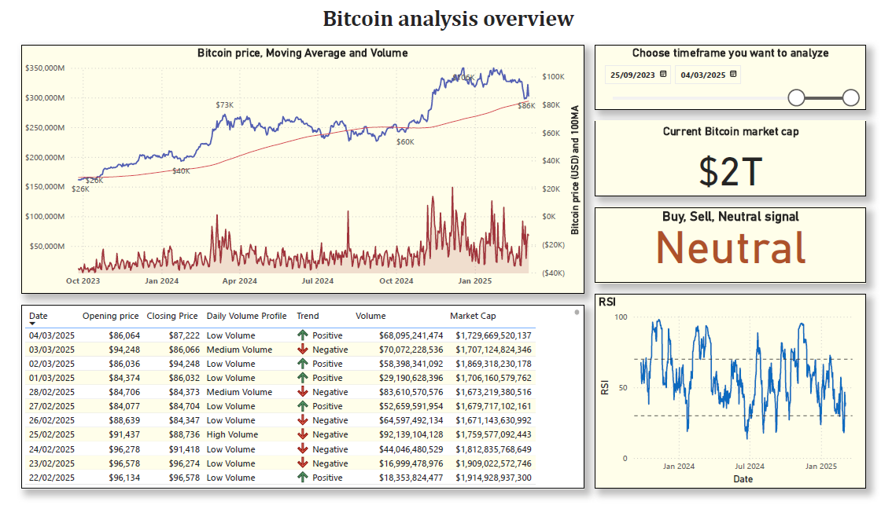
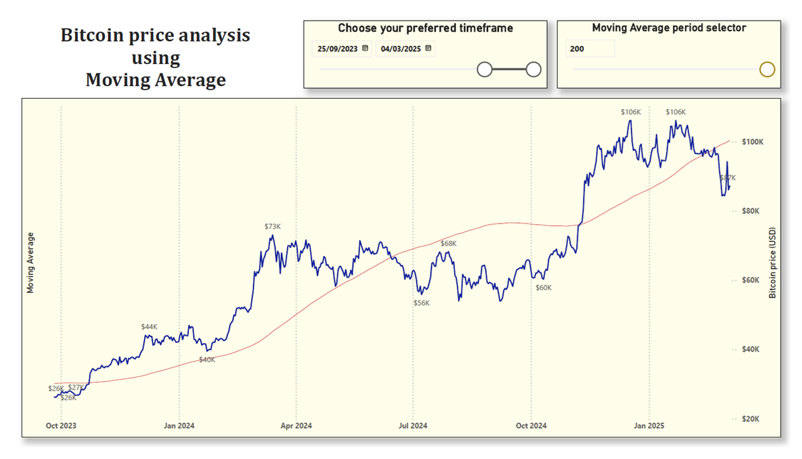

# BI-dashboards-portfolio
A collection of Power BI dashboards showcasing data analytics skills

---------------------------------------------------------------------------------------------------------------------------------------------------------------------------
---------------------------------------------------------------------------------------------------------------------------------------------------------------------------

# 1- Bitcoin price analysis dashboard

This Power BI dashboard is designed to provide an in-depth analysis of Bitcoin's market activity using multiple technical indicators such as RSI, Moving Averages, and Volume. It visualizes Bitcoin's historical price, market capitalization (both current and historical), and daily volume profile to help users analyze the market trends.

## Features

- **RSI (Relative Strength Index)**: Displays the momentum and overbought/oversold conditions of Bitcoin.
- **Moving Average**: Tracks the short-term and long-term trends of Bitcoin prices.
- **Bitcoin Historical Price and Market Cap**: Visualizes both current and historical Bitcoin prices and market capitalization.
- **Daily Volume Profile**: Categorizes the daily trading volume as high, medium, or low based on historical averages.

## Requirements

- Power BI Desktop (or Power BI Service)
- Internet connection

## Data Source

Open source .CSV data accessible from https://coinmarketcap.com/currencies/bitcoin/historical-data/

Power BI file available here [Download the Power BI Report](Bitcoin-Analysis.pbix)

##  Overview page:  

- **Price Chart**: Displays Bitcoin's historical price and moving averages over different time frames including volume.
- **RSI Indicator**: Visualizes the RSI values to help identify overbought or oversold conditions.
- **Volume Analysis**: Table showcasing specific information such as daily opening/closing price, Volume, Daily volume profile and trend.
- **Market Cap**: Displays Bitcoin's market capitalization over time, comparing it with historical data.
- **Timeframe slicer** this slicer used to select the preferred timeframe to look and analyse
- **Signal** This visual suggests possible buy/sell/netral signals based on different factors such as volume/RSI/MA. (**Not financial advice**)

  
  
## Moving Average page:  

- **Price Chart**: Displays Bitcoin's historical price and moving averages over different time frames.
- **Moving average period selector**: Using this slicer period for moving average can be modified to retrieve 50/100/150/200 days moving average.

  
  
## Contributing

Feel free to open issues or submit pull requests if you'd like to contribute to this project. Contributions are always welcome!

---------------------------------------------------------------------------------------------------------------------------------------------------------------------------
---------------------------------------------------------------------------------------------------------------------------------------------------------------------------
